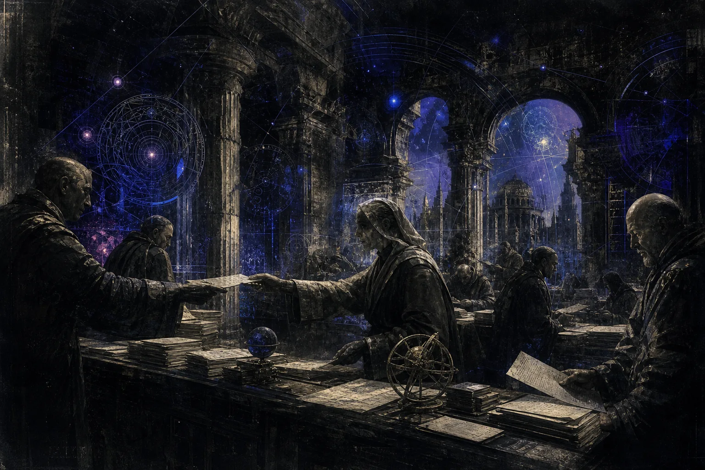

# Dispatches

<figure class="hub-hero-banner">
  
</figure>

This is the public route into the archived short-form note system. These pages are less about polished essays and more about pattern collection: signals, research fragments, tech journal entries, and working interpretations over time. The short-form archive stays in the garden, while the flagship interactive notes open directly on their live routes.

## Latest dispatches

- `Jun 18, 2026` - [[Notes/Tech_Journal/2026/deepseek v4 new attention mechanisms and 75 percent cheaper inference|DeepSeek V4 - CSA and HCA attention for 1M context at 75% cheaper]]
- `Jun 18, 2026` - [[Notes/General_Notes/2026/ascii art and the jgs font a tribute to joan g stark|ASCII art history and the Jgs font tribute to Joan G. Stark]]
- `Jun 18, 2026` - [[Notes/General_Notes/2026/epoch an exploded view of a mechanical watch cast in resin|Epoch - exploded mechanical watch cast in resin]]
- `Jun 18, 2026` - [[Notes/Tech_Journal/2026/glm 5.2 becomes the new open weights leader|GLM-5.2 becomes the new open-weights leader]]
- `Jun 18, 2026` - [[Notes/Tech_Journal/2026/adam text to cad goes open source|Adam - open source text-to-CAD]]
- `Jun 18, 2026` - [[Notes/General_Notes/2026/how madrid built its metro cheaply|How Madrid built its metro cheaply]]
- `Jun 18, 2026` - [[Notes/Tech_Journal/2026/lore epic games open source version control|Lore - Epic open source next-gen VCS]]
- `Jun 18, 2026` - [[Notes/Tech_Journal/2026/tesco moving 40000 workloads off vmware after broadcom price hikes|Tesco moving 40k workloads off VMware]]
- `Jun 18, 2026` - [[Notes/General_Notes/2026/the dialogue dividend why thinking out loud beats thinking alone|The Dialogue Dividend - why thinking out loud beats thinking alone]]

- `Feb 18, 2026` - [[Notes/Market_News/2026/provenance compliance services consolidate around audit apis|Provenance compliance services consolidate around audit APIs]] - A market-facing read on audit infrastructure consolidating into a clearer software category.
- `Feb 10, 2026` - [[Notes/Research_Digests/2026/review of trust metric drift in enterprise copilots|Review of trust metric drift in enterprise copilots]] - A compressed evidence note on why trust dashboards drift faster than teams expect.
- `Feb 02, 2026` - [[Notes/Thoughtpieces/2026/resilient automation depends on practiced reversibility|Resilient automation depends on practiced reversibility]] - A thesis note on reversibility as a real operating discipline instead of a policy slogan.

## Branches

  <a class="writing-card" href="./Field-Notes">
    Field notes
    <h3>General notes</h3>
    
Cross-domain observations, topic snapshots, and working commentary collected in shorter form.

  </a>
  <a class="writing-card" href="./Research-Digests">
    Briefs
    <h3>Research digests</h3>
    
Condensed links, arguments, and quick reads that sit between raw bookmarks and full essays.

  </a>
  <a class="writing-card" href="./Tech-Journal">
    Systems
    <h3>Tech journal</h3>
    
Engineering, tools, interfaces, and infrastructure notes written as a running journal.

  </a>
  <a class="writing-card" href="./Market-Tape">
    Market tape
    <h3>Market news</h3>
    
Short market-facing reads that capture events, incentives, and second-order implications.

  </a>
  <a class="writing-card" href="./Thoughtpieces">
    Longer frame
    <h3>Thoughtpieces</h3>
    
Opinionated framing notes that sit closer to essays than briefs.

  </a>
  <a class="writing-card" href="https://kohnnn.github.io/interactive-explanation/mechanical-watch/" target="_blank" rel="noopener noreferrer">
    Flagship interactive
    <h3>Mechanical Watch</h3>
    
Open the lead visual explainer directly when you want a high-signal interactive instead of a short archive note.

  </a>

## How to use it

- Start here when you want breadth rather than a single long read.
- Use the folder pages as shelves, not as a linear sequence.
- The public branch names stay neutral on purpose; the archive matters more than the drafting workflow behind it.
- Use [Mechanical Watch](https://kohnnn.github.io/interactive-explanation/mechanical-watch/) when you want a direct route into the visual-explainer side of the work.
- Move back to [[Portfolio/Blog|Research notes]] when you want more deliberate market writing.
