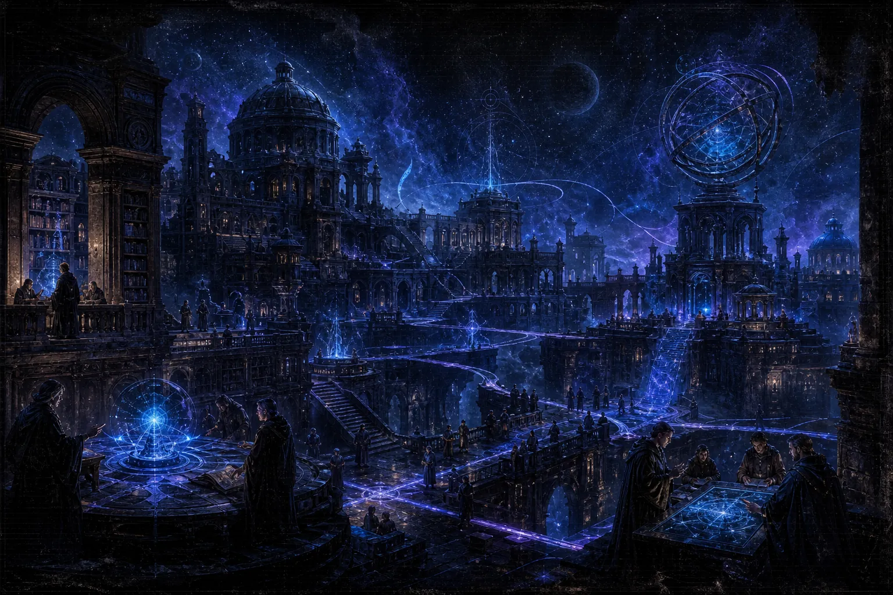

# Notes

<figure class="hub-hero-banner">
  
</figure>

This is the wider garden: archive shelves, topic notes, explainers, and branches that sit outside the portfolio casefiles. The live simulations now open on direct note routes. Use tags, backlinks, and stacked reading when you want to move laterally.

## Start here

  <a class="writing-card" href="./Start-Here">
    Orientation
    <h3>Start Here</h3>
    
The shortest guided path into the garden if you are not sure where to begin.

  </a>
  <a class="writing-card" href="./Notes/Interactive/Mechanical-Watch">
    Flagship · 15 min
    <h3>Mechanical Watch</h3>
    
The strongest single interactive explainer — escapements, gear trains, and timing.

  </a>
  <a class="writing-card" href="./Interactive">
    Index
    <h3>Interactive notes</h3>
    
Draggable simulations for social systems, model intuition, and cryptography.

  </a>
  <a class="writing-card" href="./Notes/Philosophy/">
    Library
    <h3>Philosophy</h3>
    
First-person notes on traditions, thinking tools, and the tensions behind them.

  </a>

## Archive shelves

  <a class="writing-card" href="./Dispatches">
    Short form
    <h3>Dispatches</h3>
    
The neutral public entry into briefings, digests, and topic snapshots.

  </a>
  <a class="writing-card" href="./Field-Notes">
    Fragments
    <h3>Field notes</h3>
    
Cross-domain observations and working commentary in shorter form.

  </a>
  <a class="writing-card" href="./Research-Digests">
    Briefs
    <h3>Research digests</h3>
    
Condensed links and arguments between raw bookmarks and full essays.

  </a>
  <a class="writing-card" href="./Tech-Journal">
    Systems
    <h3>Tech journal</h3>
    
Engineering, tools, interfaces, and infrastructure notes as a running log.

  </a>
  <a class="writing-card" href="./Market-Tape">
    Markets
    <h3>Market tape</h3>
    
Short market-facing reads on events, incentives, and second-order effects.

  </a>
  <a class="writing-card" href="./Thoughtpieces">
    Longer frame
    <h3>Thoughtpieces</h3>
    
Opinionated framing notes that sit closer to essays than briefs.

  </a>

## Navigate the garden

- [[tags|Tag map]] — browse the whole archive by topic.
- [[Visual Notes]] — the image-led explainer shelf.
- [[Notes/Arena|Arena]] — the outbound reference atlas.
- [[portfolio|Portfolio]] · [[Portfolio/Blog|Research notes]] — the curated proof side.
