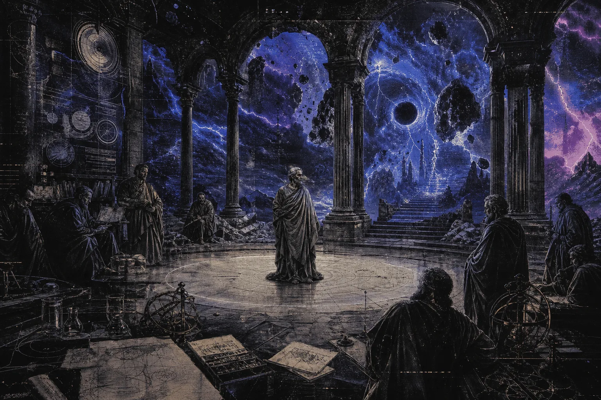

# Philosophy

<figure class="hub-hero-banner">
  
</figure>

This is the philosophy shelf: first-person notes on traditions, thinking tools, and the questions I keep circling. Each note is written as a personal working draft, not a lecture — a core claim, a lived example, and the links that tie it to neighbouring ideas. Read laterally: follow the cross-links and the conflict pairs rather than going top to bottom.

## Start here

  <a class="writing-card" href="./Stoicism - The Weather Inside">
    Flagship
    <h3>Stoicism — The Weather Inside</h3>
    
The clearest single note for how these read: control, character, and the storm inside as an optional one.

  </a>
  <a class="writing-card" href="./Buddhism - The Practice of Letting Go">
    Eastern counterpart
    <h3>Buddhism — The Practice of Letting Go</h3>
    
The release-and-attention line that most of the eastern notes branch from.

  </a>
  <a class="writing-card" href="./First Principles - Digging to Bedrock">
    Thinking tool
    <h3>First Principles — Digging to Bedrock</h3>
    
Start here if you want the reasoning-method notes rather than a tradition.

  </a>
  <a class="writing-card" href="./Philosophy Workflow - How I Write">
    Meta
    <h3>How I Write These</h3>
    
The structure, tone, and sourcing rules behind every philo note in this folder.

  </a>

## Western traditions

- [[Socrates - The Question That Bites]]
- [[Plato - The Cave I Keep Building]]
- [[Aristotle - The Mean I Miss]]
- [[Stoicism - The Weather Inside]]
- [[Epicureanism - The Garden of Enough]]
- [[Cynicism - The Bare Truth]]
- [[Pyrrhonism - The Peace of Suspension]]
- [[Neoplatonism - The Ascent of Light]]
- [[Machiavelli - The Price of Control]]
- [[Nietzsche - The Heaviest Question]]

## Eastern traditions

- [[Buddhism - The Practice of Letting Go]]
- [[Zen Buddhism - The Stillness That Cuts]]
- [[Daoism - The Strength of Softness]]
- [[Taoist Practice - The Way in the Body]]
- [[Confucianism - The Shape of Duty]]
- [[Neo-Confucianism - The Pattern in the Heart]]
- [[Mohism - The Care That Spreads]]
- [[Legalism - Order Without Warmth]]
- [[Bushido - The Steel of Restraint]]
- [[Advaita Vedanta - The One Without Edges]]
- [[Samkhya - The Twofold Reality]]
- [[Nyaya - The Rules of Knowing]]
- [[Yogacara - The Mind That Paints]]
- [[Madhyamaka - The Middle That Refuses]]
- [[Hinduism - The Many Paths]]
- [[Jainism - The Discipline of Nonviolence]]

## Faith and covenant

- [[Christianity - The Wound That Heals]]
- [[Islam - The Discipline of Mercy]]
- [[Judaism - The Covenant of Memory]]
- [[Sikhism - The Courage of Service]]
- [[Zoroastrianism - The Fire of Choice]]
- [[Augustine - The Restless Heart]]
- [[Aquinas - The Reason That Prays]]

## Civilizations and cosmologies

- [[Ancient Egypt - The River of Order]]
- [[Maya - The Calendar of Blood]]
- [[Nordic - The Cold Courage]]
- [[Shinto - The Everyday Sacred]]

## Thinking tools

- [[First Principles - Digging to Bedrock]]
- [[Abstraction - The Idea That Floats]]
- [[Thought Experiments - The Laboratory in My Head]]
- [[Intentional Stance - The Shortcut I Live By]]
- [[Memetics - The Idea That Eats Me]]
- [[Logical Tautology - When It Says Nothing and Still Works]]
- [[Fair Division - The Blueberry Pie Rule]]
- [[Etymology - The Trail Inside Words]]
- [[Epistemology - Thinking From the Floor]]
- [[Ethics - Prudence is a Muscle]]
- [[Aesthetics - The Price of Beauty]]
- [[Moral Development - The Ladder I Keep Climbing]]
- [[Evolutionary Theory - The Long Pressure]]
- [[Maslow - The Shape of Need]]

## Land and limits

- [[Environmental Philosophy - Land Turned Into a Machine]]
- [[Ecological Collapse - The Quiet Falling Apart]]
- [[Extractivism - The Hunger That Eats the Ground]]
- [[Dams - The Control That Floods]]
- [[Drought - The Discipline of Scarcity]]
- [[Wildfire - The Fast Memory]]
- [[River - The Long Witness]]

## The human weight

- [[Human Condition - The Weight of Being Here]]
- [[Mercy - The Weight of Compassion]]
- [[Forgiveness - The Harder Justice]]
- [[Surrender - The Moment I Stop Gripping]]
- [[Communicant - The Ethics of Being Heard]]
- [[Inferno - The Map of Suffering]]
- [[dante-alighieri-integrated-philosophy|Dante — Integrated Philosophy]]
- [[Artificial Intelligence - The Mirror That Talks Back]]

## How to read this shelf

- Each note opens with a core-claim callout and a reflective question — read those first to decide if you want the whole note.
- The **linkage tree** and **ideological conflicts** sections at the foot of each note are the real navigation; follow them sideways.
- Use [[Philosophy Workflow - How I Write]] if you want the template behind the format.
