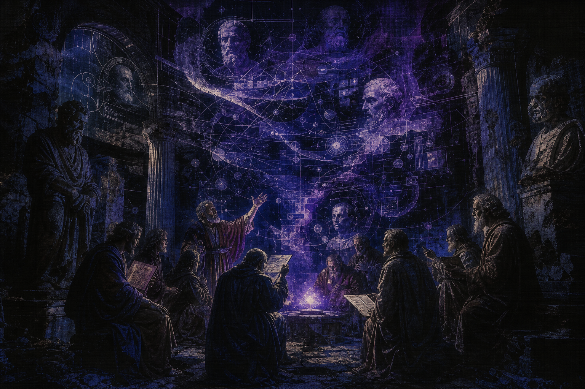

# Thoughtpieces

<figure class="hub-hero-banner">
  
</figure>

This shelf carries the more opinionated branch of the archive. These notes lean closer to essays: more interpretive, more framing-heavy, and less like a simple dispatch log.

## Shelf access

- Open the full archive shelf: [[Notes/Thoughtpieces|Thoughtpieces shelf]]
- Move to [[Research Digests]] when you want tighter evidence compression.
- Move to [[Field Notes]] when you want shorter observations instead of thesis-driven pieces.

## Framing notes

- `Feb 02, 2026` - [[Notes/Thoughtpieces/2026/resilient automation depends on practiced reversibility|Resilient automation depends on practiced reversibility]] - The core claim is that reversibility only matters if teams rehearse it often enough for it to stay real.
- `Jan 31, 2026` - [[Notes/Thoughtpieces/2026/governance ergonomics is becoming a competitive advantage|Governance ergonomics is becoming a competitive advantage]] - Argues that usable governance starts looking like product quality, not back-office drag.
- `Jan 29, 2026` - [[Notes/Thoughtpieces/2026/risk visibility beats feature velocity in ai leadership|Risk visibility beats feature velocity in AI leadership]] - A framing note on why clearer downside visibility becomes a stronger leadership trait than pure speed.
- `Jan 27, 2026` - [[Notes/Thoughtpieces/2026/accountability narratives now decide enterprise adoption|Accountability narratives now decide enterprise adoption]] - Makes the case that adoption follows explainable responsibility more than feature spectacle.
- `Aug 19, 2025` - [[Notes/Thoughtpieces/2025/reliability is becoming the language of ai competition|Reliability is becoming the language of AI competition]] - An essay-shaped argument that reliability is replacing raw capability as the better comparison axis.

## Reading posture

- Start where the framing feels most relevant, not necessarily most recent.
- Pay attention to repeated tensions and operating assumptions.
- Use the archive to trace how a worldview gets refined over time.
