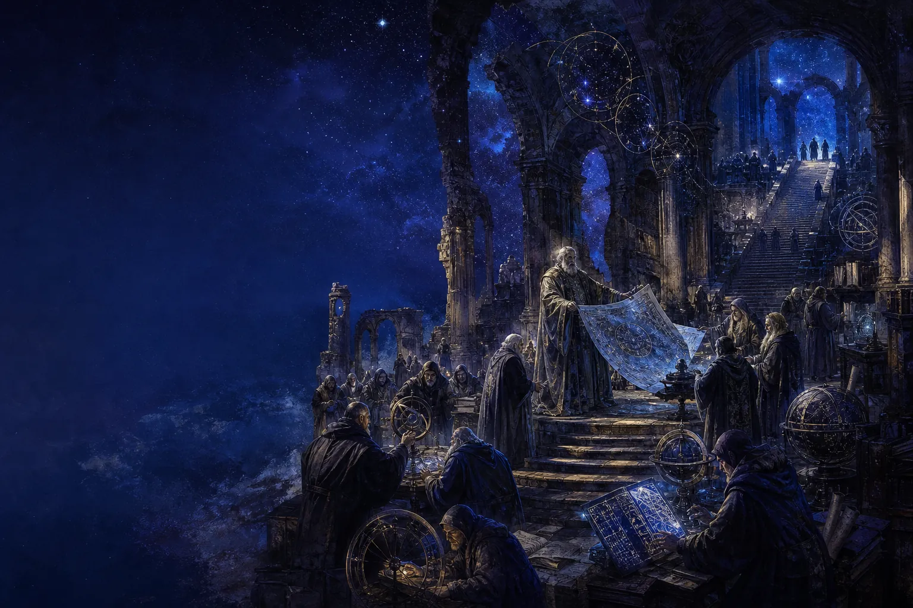
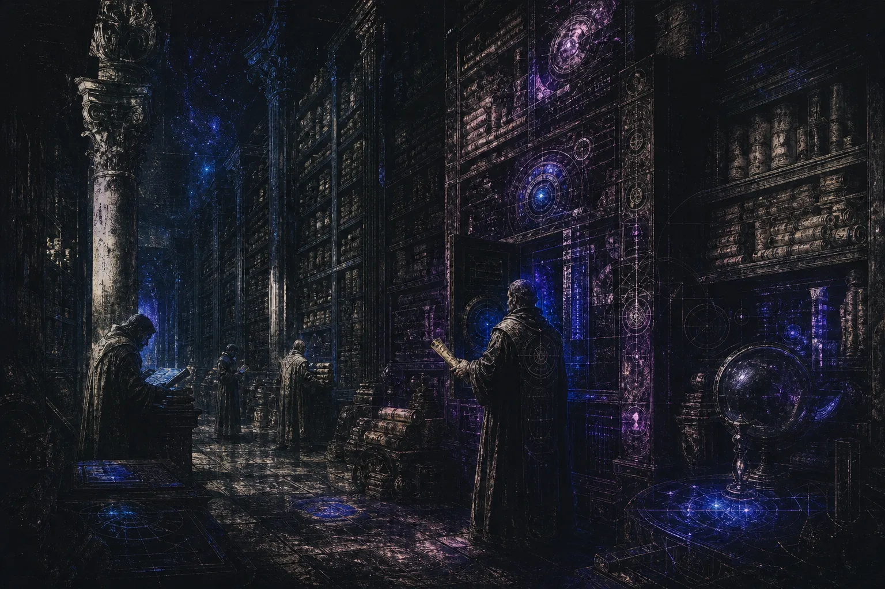

<header class="atheneum-hero" aria-label="Keith's Atheneum">
  
  

    
An ancient-future archive

    <h1 class="atheneum-wordmark">Keith's Atheneum</h1>
    
A curated hall for market systems, research notes, and the working ideas behind them.

    

      <a class="atheneum-cta atheneum-cta--primary" href="./Portfolio">Enter the Vault</a>
      <a class="atheneum-cta" href="./notes">Browse the Stacks</a>
    

  

</header>

<nav class="atheneum-routes" aria-label="Atheneum routes">
  <a class="kitchen-ticket kitchen-route-art" href="./Portfolio">
    
    
      The Vault
      <strong>Portfolio</strong>
      
Casefiles, experience, and the shortest proof path.

      13 pages - updated Mar 2026
    
  </a>
  <a class="kitchen-ticket kitchen-route-art" href="./notes">
    
    
      The Stacks
      <strong>Notes</strong>
      
Archive shelves, branching trails, and the live interactive notes.

      1,503 notes - updated Mar 2026
    
  </a>
  <a class="kitchen-ticket kitchen-route-art" href="./arena">
    
    
      The Observatory
      <strong>Arena</strong>
      
External references, channels, and rabbit holes.

      2,267 links - updated Feb 2026
    
  </a>
  <a class="kitchen-ticket kitchen-route-art" href="./Portfolio/Blog">
    
    
      The Ledger
      <strong>Research notes</strong>
      
Dated writing, frameworks, and the written operating log.

      265 memos - updated Mar 2026
    
  </a>
</nav>

<ul class="kitchen-mobile-summary" aria-label="Atheneum quick scan">
  <li class="kitchen-mobile-chip">
    Fastest
    <strong>The Vault</strong>
  </li>
  <li class="kitchen-mobile-chip">
    Archive
    <strong>The Stacks</strong>
  </li>
  <li class="kitchen-mobile-chip">
    Published
    <strong>The Ledger</strong>
  </li>
  <li class="kitchen-mobile-chip">
    Outbound
    <strong>The Observatory</strong>
  </li>
</ul>

## How to read the Atheneum

  

    The Stacks
    
Use search and the explorer when you want archive inventory, folders, and direct retrieval.

  

  

    Ingredients ledger
    
Use the map, contents, backlinks, and related notes when you want relationships instead of hierarchy.

  

  

    Reading desk
    
Open a single note when you want focused reading. Use <strong>Stack</strong> when you want a compare surface.

  

  

    Explainer lab
    
The short-form archive lives behind <a href="./Dispatches">Dispatches</a>. Mechanical Watch is the flagship interactive note, with the rest of the visual explainers linked from their own garden pages.

  

## Start at these stations

<nav class="kitchen-start-grid" aria-label="Starting stations">
  <a class="kitchen-start-card kitchen-start-card--primary" href="./Portfolio">
    The Vault
    Start with Portfolio
    
Go here when you want the fastest read on casefiles, experience, and contact.

    13 pages - updated Mar 2026
    -> Enter the vault
  </a>
  <a class="kitchen-start-card" href="./Portfolio/Blog">
    The Ledger
    Read the public log
    
Use the published research stream for dated writing, frameworks, and market-facing notes.

    265 memos - updated Mar 2026
    -> Read the ledger
  </a>
  <a class="kitchen-start-card" href="./Dispatches">
    The Stacks
    Browse Dispatches
    
Enter the short-form archive through cleaner branch doors instead of raw folder sprawl.

    5 shelves - 1,503 notes
    -> Open dispatches
  </a>
  <a class="kitchen-start-card kitchen-start-card--external" href="https://kohnnn.github.io/interactive-explanation/mechanical-watch/" target="_blank" rel="noopener noreferrer">
    Flagship interactive
    Open Mechanical Watch
    
Start with the lead visual explainer for the garden: escapements, gear trains, torque flow, and mechanical timing.

    Visual note - updated Mar 2026
    -> Launch the explainer
  </a>
</nav>
